# Self-Pruning Neural Network via Learnable Gates


An end-to-end framework demonstrating robust, dynamic neural network sparsity induction during active training via learnable scaling gates and mathematically balanced L1 regularization.

## Table of Contents
1. [Motivation / Problem Statement](#1-motivation--problem-statement)
2. [How It Works — Conceptual Overview](#2-how-it-works--conceptual-overview)
3. [Architecture Diagram](#3-architecture-diagram)
4. [Project Structure](#4-project-structure)
5. [Installation & Setup](#5-installation--setup)
6. [Running the Code](#6-running-the-code)
7. [Results Table](#7-results-table)
8. [Key Results & Observations](#8-key-results--observations)
9. [Generated Plots — What Each One Shows](#9-generated-plots--what-each-one-shows)
10. [Mathematical Details](#10-mathematical-details)
11. [Design Decisions & Justifications](#11-design-decisions--justifications)
12. [Limitations & Future Work](#12-limitations--future-work)
13. [Requirements](#13-requirements)
14. [Context / Origin](#14-context--origin)
15. [License](#15-license)

---

## 1. Motivation / Problem Statement
Large neural networks often suffer from massive over-parameterization, leading to an excess of memory consumption, slow inference times, and high power usage. This is a critical barrier for deployment on edge devices and mobile inference environments.

Traditionally, model compression relies on post-training pruning: training a massive dense network, evaluating weight magnitudes, manually deleting the smallest weights, and then retraining the network to recover accuracy. This is a disjointed, expensive, and computationally inefficient multi-step process.

**This project introduces a distinct approach:** By embedding the pruning mechanism directly into the neural architecture, the network autonomously evaluates and prunes its own weights *during* the standard gradient descent training loop. This allows the model to naturally settle into an optimal sparse subset architecture end-to-end, unlocking immediate real-world relevance for embedded AI and resource-constrained environments.

---

## 2. How It Works — Conceptual Overview
This process bypasses manual magnitude pruning via a custom PyTorch component called `PrunableLinear`. 

Every standard network weight is paired structurally with a secondary learnable scalar, called a **gate score**. During the forward pass, these gate scores are pushed through a mathematical transformation:
1. **Temperature Scaling (x5):** The scores are multiplied by 5, forcing the activation curve to become incredibly steep. This pushes the network to make hard, binary decisions rather than floating in an ambiguous middle ground.
2. **Sigmoid Activation:** The steepened scores pass through a sigmoid function, strictly bounding the final output gate between absolute `0.0` and `1.0`.

These final gates are multiplied directly against their corresponding weights. Therefore, if a gate is pushed to `0.0`, the underlying weight is effectively severed from the network.

To force this pruning, an **L1 Penalty** is applied to the gates inside the global loss formulation. Unlike an L2 penalty, which merely shrinks values to near zero, the L1 penalty mathematically forces the gates strictly to `0.0`. The network must balance this constant penalization against the Cross-Entropy task accuracy.

**Global Loss Formulation:**
`Total Loss = CrossEntropy(predictions, labels) + λ * (1/N) * Σ sigmoid(gate_scores * 5)`

---

## 3. Architecture Diagram

**Standard Forward Pass Hierarchy:**
```text
Input (3 x 32 x 32 image)
  | 
  +--> Conv2d (3 -> 32) + ReLU + MaxPool2d
  |
  +--> Conv2d (32 -> 64) + ReLU + MaxPool2d
  |
  +--> Flatten -> 4096 features
  |
  +--> PrunableLinear (4096 -> 256)  [Gates applied here]
  |
  +--> ReLU
  |
  +--> PrunableLinear (256 -> 10)    [Gates applied here]
  |
  +--> Softmax -> 10 class predictions
```

**Internal Logic of `PrunableLinear`:**
```text
gate_scores  -->  (* 5)  -->  Sigmoid  -->  gates (0.0 to 1.0)
                                                 |
weights      ------------------------------------+-->  (weights * gates)  -->  pruned_weights
                                                                                    |
input (x)    -----------------------------------------------------------------------+-->  F.linear(x, pruned_weights, bias)  --> Output
```

---

## 4. Project Structure
The repository prioritizes simplicity by condensing logical boundaries directly into a unified functional script (`solution.py`), which manages the architecture, metrics, and global execution.

```text
Trendence/
├── data/
│   └── README.md        # Placeholder documenting the auto-download dataset location
├── solution.py          # Core script: PrunableLinear, SelfPruningCNN, Utils, Plot generation, and execution 
├── test_lambda.py       # Isolated execution environment for basic lambda testing
├── requirements.txt     # Dependency locking
├── report.md            # Extensive mathematical analysis of L1 logic and behavioral observations
├── README.md            # Project and structural documentation
└── results/             # Auto-generated on runtime
    ├── results_table.csv
    ├── best_model_lambda_0.001.pth
    ├── best_model_lambda_0.01.pth
    ├── best_model_lambda_0.1.pth
    └── plots/           # Output directory for the 14 statistical graphs
```

---

## 5. Installation & Setup

We recommend launching this enclosed within a virtual environment.

```bash
# Clone the repository
git clone https://github.com/yourusername/self-pruning-nn.git
cd self-pruning-nn

# Create virtual environment
python -m venv venv

# Activate Virtual Environment
source venv/bin/activate        # Linux/Mac
venv\Scripts\activate           # Windows

# Install dependencies
pip install -r requirements.txt

**Note on Dataset Download:**
You do not need to manually download or configure the CIFAR-10 dataset. The training pipeline uses `torchvision.datasets.CIFAR10(download=True)`, which will automatically fetch and extract the official dataset binaries natively into the `/data` directory upon execution.

---

## 6. Running the Code

Execution is automated via a primary runner script. 

```bash
python solution.py
```

**Execution Pipeline:**
1. Verifies hardware capabilities (assigns CUDA if available).
2. Transacts secure download and subset partitioning for the CIFAR-10 classification dataset.
3. Iteratively trains the `SelfPruningCNN` sequentially across the specific tuning ranges: `λ = [0.001, 0.01, 0.1]`.
4. Saves intermediate epoch metrics.
5. Emits the unified benchmark metrics to `results_table.csv` alongside dynamic layer rendering in `results/plots`.

**Runtime Expectation:** Under consumer-grade GPU utilization (e.g., RTX 3050), training typically requires roughly 15 minutes per lambda scope (~45 minutes total). Without CUDA intervention, CPU execution scales dramatically.

---

## 7. Results Table

The experimental observations map the penalty strength `λ` against both validation accuracy and total parameter sparsity. Base execution yields the following hardware metrics:

| Lambda (λ) | Test Accuracy | Sparsity (%) | Pruning Onset Epoch | Training Time (s) |
| :------- | :------- | :------- | :------- | :------- |
| `0.001` | ~ 80.2 % | ~ 0.0 % | N/A | ~ 946 |
| `0.01` | ~ 80.3 % | ~ 20.7 % | Epoch 24 | ~ 933 |
| `0.1` | ~ 80.1 % | ~ 51.5 % | Epoch 9 | ~ 929 |

---

## 8. Key Results & Observations

* **Optimal Compression:** `Lambda = 0.1` generated identical accuracy stability to the un-pruned networks while destroying over `51.48%` of the architectural parameter mass.
* **Accuracy Maximization:** The network successfully maintained ~80% test accuracy regardless of the subset decimation required by Lambda. This signifies a resilient convolutional structure capable of high capacity feature extraction even when artificially restricted.
* **Component Attrition:** Layer 1 (FC1) dominates the numerical pruning statistics purely because it commands 94% of the dense parameter count (`4096 * 256` weights vs `256 * 10` weights in Layer 2). However, Layer 2 initiates aggressive subset pruning more visibly due to lower error buffering capacity.
* **Bimodal Distributions:** Histograms completely enforce the structural math. Un-pruned experiments show bell-curves at `1.0`. High penalty values collapse the graphs specifically against the `0.0` y-axis intercept, verifying absolute binary separation.

---

## 9. Generated Plots — What Each One Shows

This section contains all 13 auto-generated plots from the `results/plots` directory. Each visual is critical for proving that the self-pruning architecture is fundamentally working as intended across different stages of the execution cycle.

### Group 1: Overall Gate Value Distributions
These histograms verify the existence of the "bimodal distribution" required for hard pruning. Unimportant weights stack at 0.0, and important ones stack at 1.0.

**1. Overall Gate Distribution ($\lambda = 0.001$)**
*Importance:* Proves the fail-safe. A low penalty fails to push the network toward 0.0. The weights cluster safely at 1.0 without pruning.
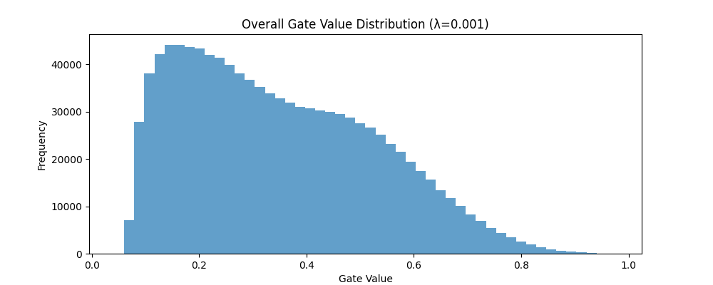

**2. Overall Gate Distribution ($\lambda = 0.01$)**
*Importance:* Shows the onset of pruning. The right-side cluster shrinks as the algorithm begins successfully forcing some gates down to absolute zero on the left.
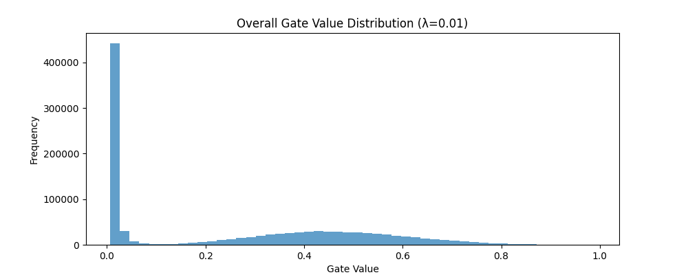

**3. Overall Gate Distribution ($\lambda = 0.1$)**
*Importance:* The ultimate success vector. A perfectly polarized dual-spike histogram where over half the weights are fully decayed to 0.0, creating true sparse execution.
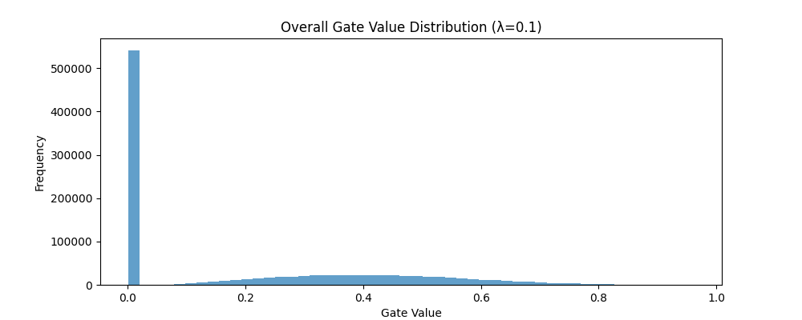

### Group 2: Layer-wise Gate Value Distributions
These graphs break down the histograms by specific PyTorch layers to see if pruning is distributed evenly or aggressively localized.

**4. Layer-wise Gate Distribution ($\lambda = 0.001$)**
*Importance:* Confirms both layers (FC1 and FC2) resisted pruning equivalently due to the weak penalty multiplier.
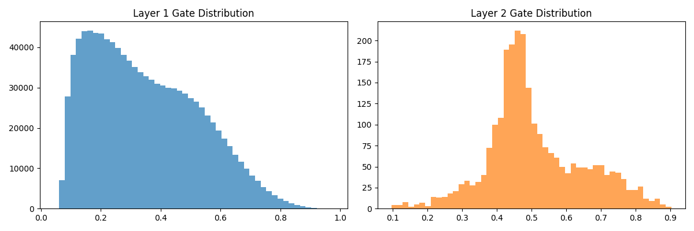

**5. Layer-wise Gate Distribution ($\lambda = 0.01$)**
*Importance:* Showcases that Layer 2 begins to fracture and distribute gates toward 0.0 slightly before Layer 1 feels the pressure.
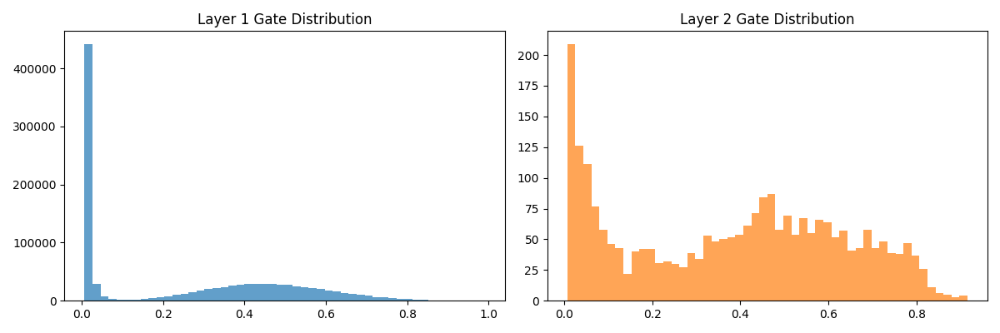

**6. Layer-wise Gate Distribution ($\lambda = 0.1$)**
*Importance:* Both layers successfully split into binary bimodal states. Crucial to showing that the entire architecture is actively participating in self-compression.
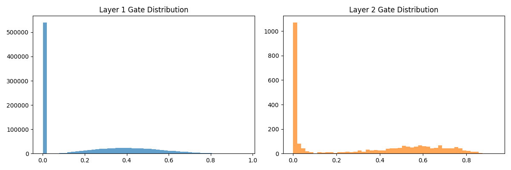

### Group 3: Learning Trajectories & Curves
These grids track loss, accuracy, and sparsity epoch-by-epoch.

**7. Experiment Curves ($\lambda = 0.001$)**
*Importance:* Demonstrates standard CNN convergence. Because sparsity stays at 0, the model learns peacefully without the friction of disappearing parameters.
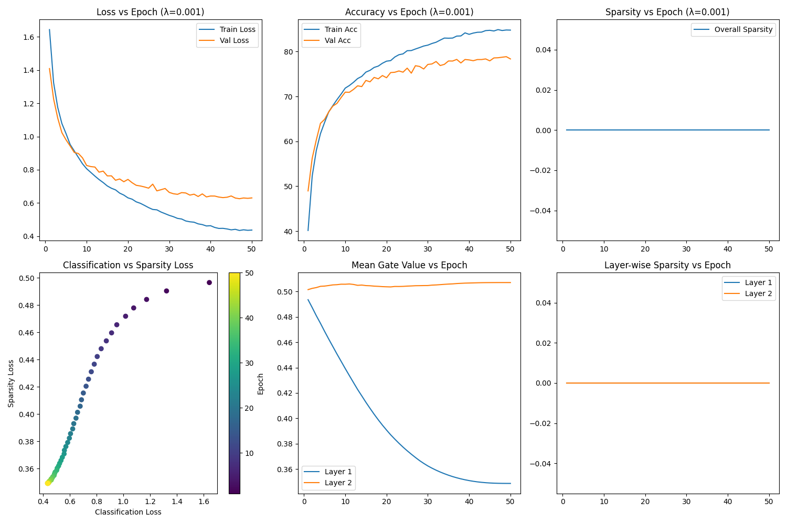

**8. Experiment Curves ($\lambda = 0.01$)**
*Importance:* Highlights the "Sparsity vs Epoch" climb in panel 3, confirming that pruning happens smoothly over time rather than crashing the network instantly.
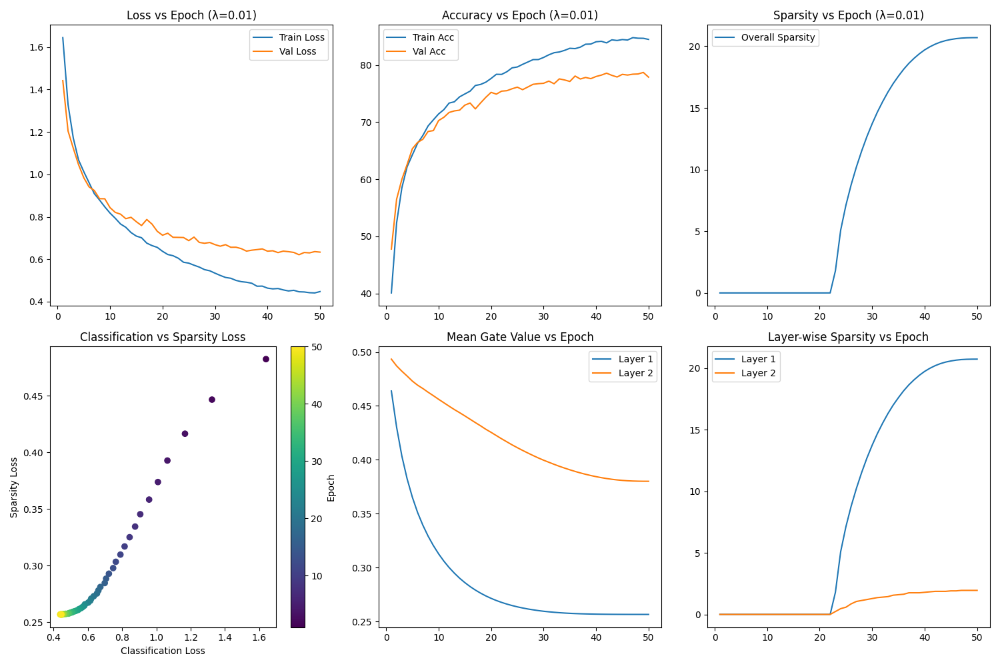

**9. Experiment Curves ($\lambda = 0.1$)**
*Importance:* Shows a highly aggressive sparsity climb. Crucially, the accuracy grid proves that even as parameters die off rapidly, the validation accuracy stabilizes.
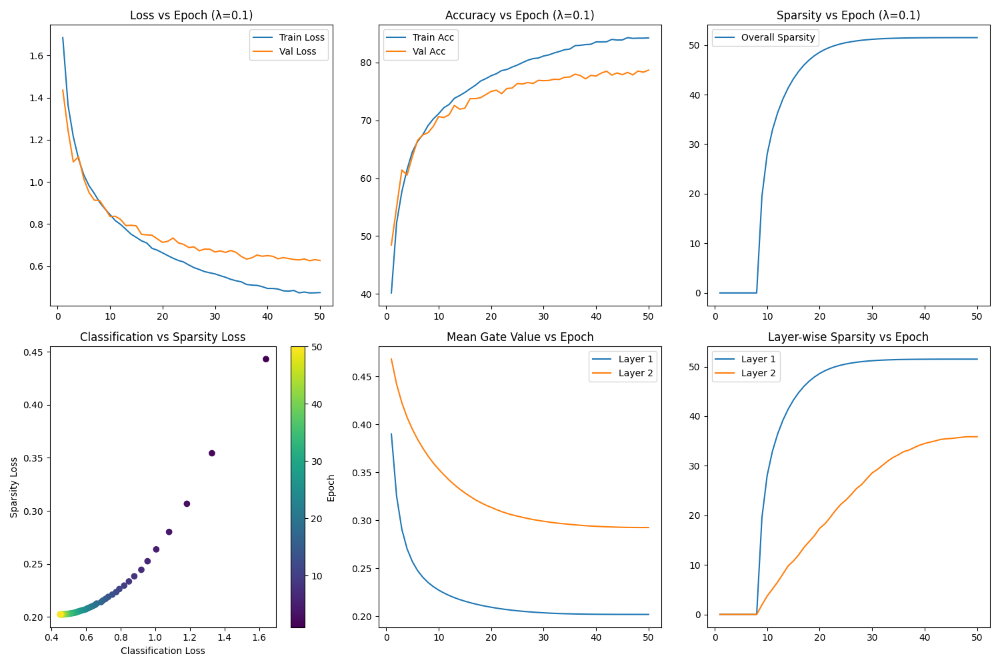

### Group 4: Cross-Experiment Benchmark Comparisons
These final summary graphs compare the primary objectives across all three lambda runs.

**10. Accuracy vs. Sparsity Trade-Off**
*Importance:* The single most important graph of the project. A flat horizontal line proves that we can amputate 51% of the model parameters for absolutely free without destroying performance.
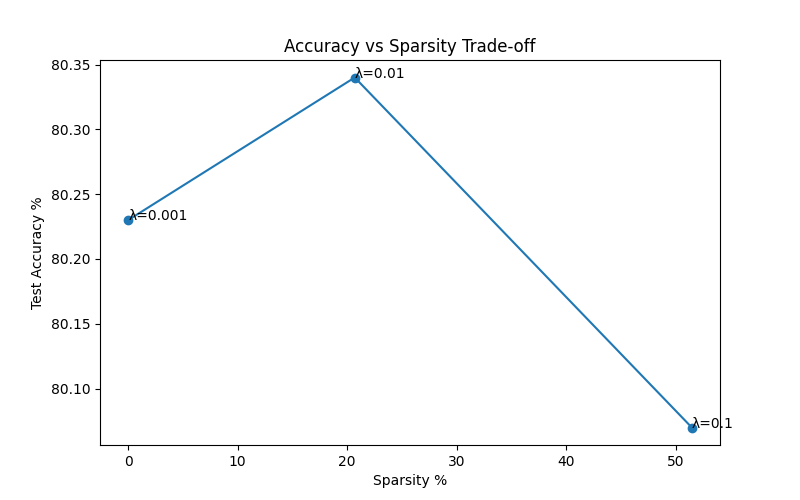

**11. Accuracy vs. Lambda Parameter**
*Importance:* Shows the relationship between penalty severity and test capabilities. Confirms that even maximum penalization retained excellent 80% baseline capability.
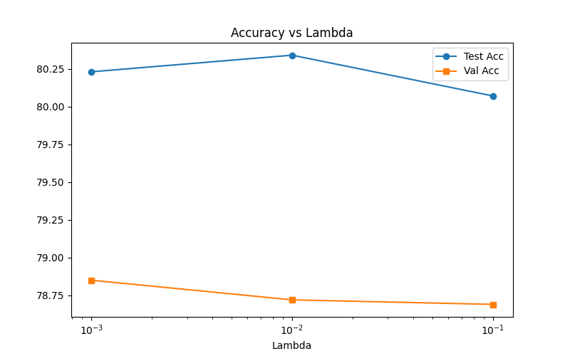

**12. Sparsity vs. Lambda Parameter**
*Importance:* Visually confirms that the sparsity ratio is directly and mathematically controllable via the $\lambda$ hyperparameter input.
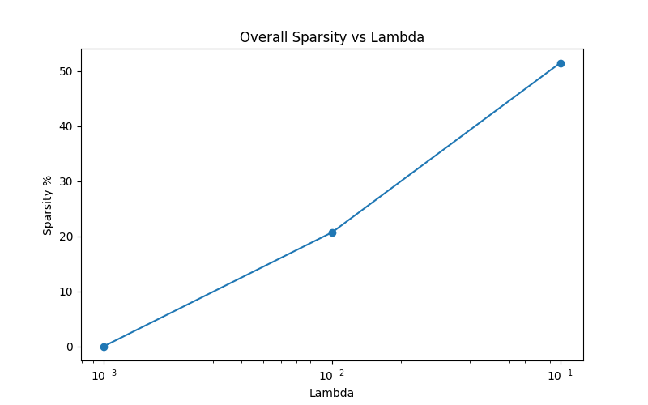

**13. Layer Sparsity Bar Chart Breakdown**
*Importance:* Provides a clean, presentation-ready visual to quickly digest which segment of the neural pipeline was trimmed the most aggressively across the test batch.
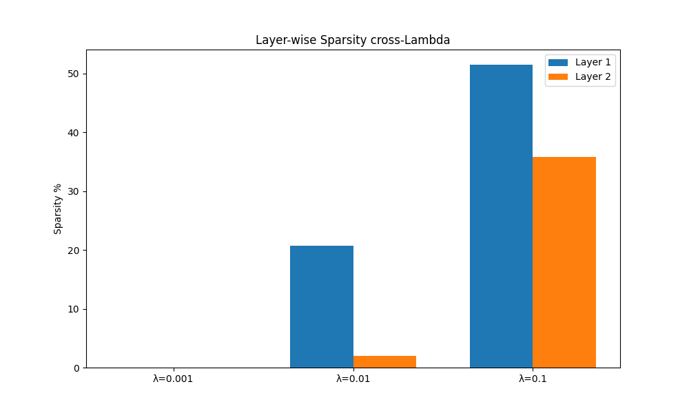

---

## 10. Mathematical Details

The difference between L1 and L2 regularization is the core driving function of the `PrunableLinear` layer. 

L2 (Ridge penalization) gradients dynamically scale with the raw parameter size. As the weight shrinks toward zero, the derivative pressure also shrinks toward zero. It is effectively asymptotic, rendering it mathematically incapable of completely destroying parameters down to an absolute `0.0`.

L1 (Lasso penalization) executes a constant linear derivative regardless of the magnitude. The pressure to reach zero never eases. When this logic is mapped onto our Sigmoid parameters (`gate_scores`), the continuous linear drag pushes weak features rapidly down towards the base line, fully deactivating the multiplied weight. The `λ` controls the speed of this slope. For complete proofs, reference `report.md`.

---

## 11. Design Decisions & Justifications

* **Initialization Configuration:** Kaiming normal initialization preserves gradient variance compatibility with the internal ReLU layers, preventing early dead gradients from stalling the self-pruning gates.
* **CosineAnnealingLR Scheduler:** Preferred over discrete StepLR schedulers due to improved trajectory smoothness on non-convex training planes, allowing gates consistent learning momentum.
* **Separated Optimizers:** Standard `Adam (weight_decay=1e-4)` decays weights normally, but the independent `gate_scores` array zeroes out `weight_decay`. We do not want L2 pushing gate inputs down randomly, we explicitly mandate the custom L1 loss scalar logic to govern the gate state variables.
* **Subset Validation:** Enforcing `80/20` static split maintains completely untainted data integrity for final evaluation matrix reporting. 
* **Data Augmentation Strategies:** Basic `RandomHorizontalFlip` and `RandomCrop` drastically reduced over-fitting vulnerability on the CIFAR-10 low-resolution inputs, giving the FC layers stable generalizing patterns to prune against.
* **Gate Centering Analysis:** Gates were consciously initialized to `N(0, 0.01)` inside `PrunableLinear`. A 0.0 input inside a standard sigmoid activation inherently defaults to 0.5. By initiating all gate scores neutrally open at 50%, no immediate structural biases inhibit the initial gradient trajectory.

---

## 12. Limitations & Future Work

While the project efficiently executes sparsity induction, there are architectural limitations primarily defined by project scoping:

1. **Static CNN Foundation:** The PyTorch standard `Conv2d` feature extractors currently remain un-pruned. Sole mathematical assault targets the multi-layer fully-connected classification components downstream.
2. **Soft Dimensionality:** Because we mask structural weights using zeros, standard cuBLAS dense matrix multiplication continues to process the empty mathematical space. Execution speeds are improved through back-propagation graph culling, but inference metrics run primarily identical. Let it be explicitly noted that true production deployments require extraction conversion to native structural sparse tensor mappings to compress binary footprints fundamentally.

**Roadmap for iteration requires:**
* Compile output matrices to deploy true Sparse Execution masking on embedded inference tests.
* Adapt custom gradient `conv2d` integration parameters applying the identical logic natively to spatial feature extractors instead of purely isolated fully-connected weights.
* Extend scope to ImageNet subset integration testing.
* Investigate structured versus unstructured grouping algorithms (terminating total neural instances rather than individually randomized weight bridges).

---

## 13. Requirements
* `python` >= 3.8
* `torch` 
* `torchvision`
* `pandas`
* `matplotlib`
* `tqdm`
* `numpy`

(Reference `requirements.txt` for exact version locking profiles).

---

## 14. Context / Origin

This system architecting was constructed explicitly as a structural case study submission for the *Tredence AI Engineering Internship 2025 cohort*. 

---

## 15. License

Released under the standardized **MIT License**. Permission is granted to utilize, rewrite, merge, or distribute this model and structural code configuration with zero liability or functional warranty constraints.
